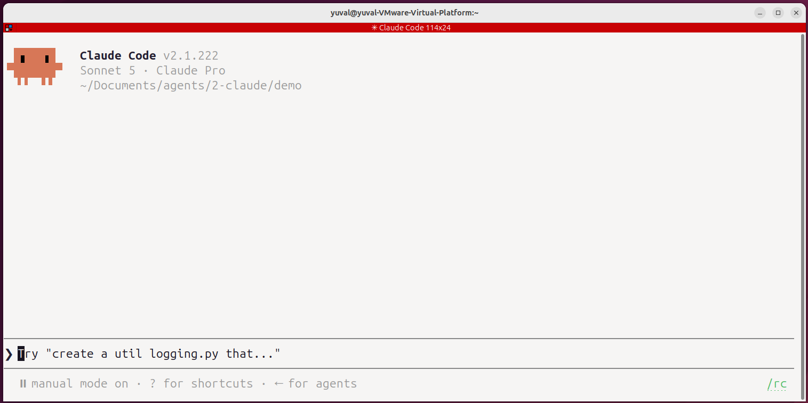

# Interacting with Claude Code

A short, hands-on tour of the Claude Code interface: starting a session, reading
the first screen, finding where your credentials live, using condensed/expanded
tool output, switching permission modes, and reading local configuration.

Do this inside [`demo/`](../demo) so you have a real (if tiny) project to point
Claude at, rather than an empty directory. This file itself stays here, one
level up — you won't be editing it, just following along from wherever your
terminal is.

## 1. Start Claude Code

```
cd demo
claude
```

If you're not logged in yet, see [`1-getting-started.md`](../1-getting-started/1-getting-started.md)
first.

## 2. The first view

When the session opens you should see, top to bottom:

- A header showing the **active model** and the current working directory.
- A **greyed-out example prompt** in the input box — Claude Code drafts this
  from the directory's recent git history, just to show you the input works.
  It's not a suggestion you have to follow.
- The **input box** itself, where you type.
- A **status line** under the box showing the current **permission mode**
  (more on this below).



Nothing has been sent to Claude yet at this point — it's a local, empty
conversation. Try asking something trivial to confirm it's alive:

> What files are in this directory?

## 3. Where your credentials live

Claude Code stores your login separately from everything else it writes to
disk. Open a **second terminal** (leave your Claude session running) and look:

```
ls -la ~/.claude/.credentials.json
```

On Linux and Windows this file holds your OAuth token, and permissions are
locked down to your user only (`600`). On macOS, the same token is stored in
the system Keychain instead of a plain file. Either way, `/logout` (typed
inside a Claude session) is what clears it — don't delete the file by hand.

## 4. Condensed vs. expanded tool output

By default, when Claude runs a tool (reads a file, runs a command, edits
code), the conversation shows a **condensed** one- or two-line summary of it,
not the full input/output — this keeps a long session readable.

Try it:

> Read main.py and summarize what the API does

Watch the tool call appear as a condensed line. Now press **Ctrl+O**. This
expands the transcript to show the full detail of every tool call — complete
file contents, full command output, everything. Press **Ctrl+O** again to
collapse it back to condensed view. This toggle doesn't change what Claude
did, only how much of it you're currently looking at.

## 5. Permission modes

Claude Code won't run just anything unsupervised — every tool call is
governed by a **permission mode**, shown in the status line at the bottom of
the screen. Press **Shift+Tab** to cycle through the modes and watch the
status line change:

- **default** (shown as *manual*) — Claude asks before anything that
  changes state: edits, writes, most shell commands. Read-only actions
  (reading files, searching) go through without asking.
- **plan** — Claude can only read and explore; it can propose a plan but
  cannot edit files or run state-changing commands until you approve and
  exit plan mode.
- **accept edits** — file edits and previously-approved-shaped commands run
  without a prompt; this is convenient for fast iteration but means you're
  trusting Claude to stay on task.
- **bypass permissions** — skips essentially all checks. Only ever use this
  in a disposable sandbox with no network/credentials worth protecting — not
  here.

Try a small experiment:

1. Shift+Tab into **plan** mode and ask: *"How would you add a search
   endpoint to this API?"* — notice it proposes an approach but doesn't touch
   any files.
2. Shift+Tab back to **default**, ask Claude to make a small doc change (e.g.
   fix a typo in `CLAUDE.md`), and notice you're prompted to approve the
   edit.

## 6. Local configuration

Permission modes are the session-level control; **settings files** are the
persistent, project-level control. Look at the one already in `demo/`:

```
cat .claude/settings.json
```

```json
{
  "$schema": "https://json.schemastore.org/claude-code-settings.json",
  "permissions": {
    "allow": [
      "Read", "Glob", "Grep",
      "Bash(pip install*)", "Bash(pytest*)", "Bash(uvicorn main:app*)", "..."
    ],
    "deny": [
      "Bash(rm -rf *)", "Bash(git push --force*)"
    ]
  }
}
```

This is why running `pytest` or `pip install` inside `demo/` doesn't prompt
you every time, while a force-push would always be blocked outright, in any
mode. A few things worth knowing about where settings live:

| File | Scope | Committed to git? |
|---|---|---|
| `~/.claude/settings.json` | Your global defaults, every project | n/a (lives outside any repo) |
| `.claude/settings.json` | This project, shared with the team | Yes — this is the one you just read |
| `.claude/settings.local.json` | This project, just for you | No — gitignored automatically |

If you wanted to allow something for yourself without changing the shared
project file (say, a personal shortcut command), you'd add it to
`.claude/settings.local.json` instead — try creating one with an extra
`allow` entry and notice `git status` doesn't pick it up.

## Recap

You've now seen the four things worth knowing before doing any real work in
Claude Code: what the first screen is telling you, where your login lives,
how to expand a condensed tool call when you need the full detail, and how
permission modes and settings files together decide what Claude is allowed
to do without asking. From here, move on to
[`3-first-project.md`](../3-first-project/1-first-project.md) to build something.
