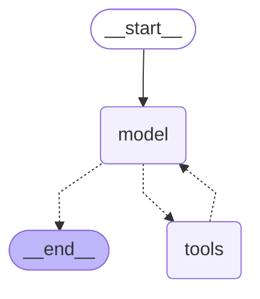

# `langchain` Reference

> **Superseded.** A newer edition of this file, updated to langchain 1.4.0 with re-verified examples,
> lives on yuval.guide: <a href="https://www.yuval.guide/ai/langchain-reference/" target="_blank" rel="noopener">langchain-reference</a>.
> The <a href="https://www.yuval.guide/ai/langchain-stack/" target="_blank" rel="noopener">stack overview</a> explains how the three packages relate.
> This copy is kept as it was for the course material that references these versions.

**Pinned versions: `langchain==1.3.14`**, which resolved `langchain-core==1.5.3`,
`langgraph==1.2.10` and (for the one live example) `langchain-anthropic==1.5.4`. Everything below
was derived by inspecting these exact installed packages, and every example was executed against
them. Each heading links to
[reference.langchain.com](https://reference.langchain.com/python/langchain), which is unversioned
and always serves the latest 1.x.

## What `langchain` is in 1.x

- **It is the prebuilt agent layer on top of `langgraph`.** It no longer implements execution
  itself; it assembles graphs and hands them to the langgraph runtime.
- **An agent from `create_agent` *is* a compiled langgraph `StateGraph`.** The return annotation is
  literally `CompiledStateGraph[...]`, so `invoke`, `stream`, `get_state`, checkpointers and
  `interrupt` all behave exactly as in the langgraph reference.
- **Its own contribution is the agent loop and middleware.** The model↔tools cycle, structured
  output, and hooks for changing agent behaviour without rewriting the graph.
- **Layer order:** `langchain` → `langgraph` → `langchain-core`. Import from the lowest layer that
  provides what you need.

> **Old tutorials warning:** `AgentExecutor`, `initialize_agent` and the `Chain` classes
> (`LLMChain`, `ConversationChain`, …) are 0.x patterns now parked in `langchain-classic` — all are
> absent from `langchain.agents` in 1.3.14, and `from langchain.agents import AgentExecutor` raises
> `ImportError`. If a tutorial uses them, it predates 1.0.

## Index

| Name | What it is | Most-used parameters & methods |
| --- | --- | --- |
| [`create_agent`](#create_agent) | Builds a ready-made agent as a compiled graph | `model`, `tools`, `system_prompt`, `middleware`, `response_format`, `checkpointer` |
| [`AgentState`](#agentstate) | The state schema an agent runs on | `messages`, `structured_response`, `jump_to` |
| [`AgentMiddleware`](#agentmiddleware) | The extension point for changing agent behaviour | `before_model`, `after_model`, `wrap_model_call`, `wrap_tool_call` |
| [`@before_model`](#before_model) | Decorator that makes middleware from one function | `before_model`, `after_model`, `wrap_model_call` |
| [`HumanInTheLoopMiddleware`](#humanintheloopmiddleware) | Pauses before chosen tools for approval | `interrupt_on`, `description_prefix` |
| [`ContextEditingMiddleware`](#contexteditingmiddleware) | Trims stale tool output from the model's context | `edits`, `token_count_method` |
| [`ToolStrategy`](#toolstrategy) | Structured output, via `create_agent(response_format=…)` | `schema`, `handle_errors` |
| [`init_chat_model`](#init_chat_model) | Builds a chat model from a `"provider:name"` string | `model`, `model_provider`, `temperature` |

---

### [`create_agent`](https://reference.langchain.com/python/langchain/agents/factory/create_agent)

The one function most 1.x apps start from. Give it a model and tools and it returns a compiled
langgraph graph implementing the agent loop: call the model, run any tools it asked for, feed the
results back, repeat until the model answers without tool calls. `system_prompt` sets standing
instructions, `checkpointer` makes runs resumable, and `middleware` and `response_format` are
covered in their own sections below.

```python
from langchain_core.language_models.fake_chat_models import GenericFakeChatModel
from langchain_core.messages import AIMessage
from langchain_core.tools import tool
from langchain.agents import create_agent


class FakeToolModel(GenericFakeChatModel):
    """GenericFakeChatModel plus the bind_tools() the agent loop requires."""

    def bind_tools(self, tools, **kwargs):
        return self


@tool
def add(a: int, b: int) -> int:
    """Add two integers."""
    return a + b


# Scripted replies stand in for a real model: first a tool call, then the answer.
model = FakeToolModel(messages=iter([
    AIMessage(content="", tool_calls=[{"name": "add", "args": {"a": 2, "b": 3}, "id": "c1"}]),
    AIMessage(content="The answer is 5."),
]))

agent = create_agent(model=model, tools=[add], system_prompt="You are a careful calculator.")
result = agent.invoke({"messages": [{"role": "user", "content": "what is 2+3?"}]})

for m in result["messages"]:
    print(type(m).__name__, "|", repr(m.content))
# HumanMessage | 'what is 2+3?'
# AIMessage | ''            <- the tool call
# ToolMessage | '5'
# AIMessage | 'The answer is 5.'

print(type(agent).__name__)   # CompiledStateGraph
print(agent.get_graph().draw_mermaid())
```

**The reveal** — `create_agent` returns a `CompiledStateGraph`, so you can print the graph it built
for you. This is the graph `create_agent` built for you:



`model -.-> tools` and `tools -.-> model` are the agent loop; `model -.-> __end__` is the exit taken
when the model replies without tool calls. (`draw_mermaid()` wraps labels in `<p>` tags, which
GitHub shows as literal text — the block above is the same output with HTML tags stripped.)

#### The one live example

Everything else in this file runs offline. This is the single variant that talks to a real
provider; it skips itself when `ANTHROPIC_API_KEY` is absent.

```python
import os

from langchain_core.tools import tool
from langchain.agents import create_agent
from langchain_anthropic import ChatAnthropic


@tool
def add(a: int, b: int) -> int:
    """Add two integers."""
    return a + b


if os.environ.get("ANTHROPIC_API_KEY"):
    agent = create_agent(model=ChatAnthropic(model="claude-sonnet-4-5"), tools=[add])
    result = agent.invoke({"messages": [{"role": "user", "content": "what is 2+3?"}]})
    print(result["messages"][-1].text)
else:
    print("ANTHROPIC_API_KEY not set — skipping live example.")
```

[↩ back to index](#index)

---

### [`AgentState`](https://reference.langchain.com/python/langchain/agents/middleware/types/AgentState)

The state schema an agent runs on — the langgraph state, with the keys the agent loop needs. It
has three: `messages` (the conversation, merged with the `add_messages` reducer),
`structured_response` (populated only when `response_format` is set) and `jump_to` (used by
middleware to redirect control flow). Subclass it to carry extra keys of your own.

```python
from langchain_core.language_models.fake_chat_models import GenericFakeChatModel
from langchain_core.messages import AIMessage
from langchain.agents import AgentState, create_agent

print(list(AgentState.__annotations__))
# ['messages', 'jump_to', 'structured_response']

agent = create_agent(model=GenericFakeChatModel(messages=iter([AIMessage("hi back")])), tools=[])
result = agent.invoke({"messages": [{"role": "user", "content": "hi"}]})
print(list(result))                       # ['messages']
print(result["messages"][-1].content)     # hi back
```

[↩ back to index](#index)

---

### [`AgentMiddleware`](https://reference.langchain.com/python/langchain/agents/middleware/types/AgentMiddleware)

The extension point. Rather than rebuilding the graph, you attach middleware that hooks the agent
loop at defined points: `before_model` / `after_model` run either side of a model call, and
`wrap_model_call` / `wrap_tool_call` wrap them so you can inspect, modify or replace the call.
Subclass it when your middleware needs state of its own.

```python
from langchain_core.language_models.fake_chat_models import GenericFakeChatModel
from langchain_core.messages import AIMessage
from langchain.agents import create_agent
from langchain.agents.middleware import AgentMiddleware


class CountingMiddleware(AgentMiddleware):
    def __init__(self):
        super().__init__()
        self.calls = 0

    def before_model(self, state, runtime):
        self.calls += 1
        return None


counter = CountingMiddleware()
agent = create_agent(
    model=GenericFakeChatModel(messages=iter([AIMessage("ok")])),
    tools=[],
    middleware=[counter],
)
agent.invoke({"messages": [{"role": "user", "content": "hi"}]})
print("before_model fired:", counter.calls)   # before_model fired: 1
```

[↩ back to index](#index)

---

### [`@before_model`](https://reference.langchain.com/python/langchain/agents/middleware/types/before_model)

For middleware that needs no state, skip the subclass: decorate a single function and pass it
straight to `middleware=`. The family is `@before_model`, `@after_model`, `@before_agent`,
`@after_agent`, `@wrap_model_call`, `@wrap_tool_call` and `@dynamic_prompt` — each hooks the point
its name describes. Returning `None` leaves the run unchanged; returning a state update changes it.

```python
from langchain_core.language_models.fake_chat_models import GenericFakeChatModel
from langchain_core.messages import AIMessage
from langchain.agents import create_agent
from langchain.agents.middleware import before_model


@before_model
def log_turn(state, runtime):
    print("[middleware] messages so far:", len(state["messages"]))
    return None


agent = create_agent(
    model=GenericFakeChatModel(messages=iter([AIMessage("hi back")])),
    tools=[],
    middleware=[log_turn],
)
print(agent.invoke({"messages": [{"role": "user", "content": "hi"}]})["messages"][-1].content)
# [middleware] messages so far: 1
# hi back
```

[↩ back to index](#index)

---

### [`HumanInTheLoopMiddleware`](https://reference.langchain.com/python/langchain/agents/middleware/human_in_the_loop/HumanInTheLoopMiddleware)

Pauses the agent before named tools run and waits for a human decision. `interrupt_on` maps tool
name to `True` (always ask) or an `InterruptOnConfig`. It needs a `checkpointer`, because pausing
means persisting the run — under the hood it calls langgraph's `interrupt`, so `invoke` returns an
`__interrupt__` key and you resume with `Command(resume=...)`. The resume payload is
`{"decisions": [...]}`, one decision per paused tool call: `{"type": "approve"}`, `{"type": "edit",
"edited_action": ...}`, `{"type": "reject", "message": ...}` or `{"type": "respond"}`.

```python
from langchain_core.language_models.fake_chat_models import GenericFakeChatModel
from langchain_core.messages import AIMessage
from langchain_core.tools import tool
from langgraph.checkpoint.memory import InMemorySaver
from langgraph.types import Command
from langchain.agents import create_agent
from langchain.agents.middleware import HumanInTheLoopMiddleware


class FakeToolModel(GenericFakeChatModel):
    def bind_tools(self, tools, **kwargs):
        return self


@tool
def add(a: int, b: int) -> int:
    """Add two integers."""
    return a + b


model = FakeToolModel(messages=iter([
    AIMessage(content="", tool_calls=[{"name": "add", "args": {"a": 2, "b": 3}, "id": "c1"}]),
    AIMessage(content="The answer is 5."),
]))

agent = create_agent(
    model=model,
    tools=[add],
    middleware=[HumanInTheLoopMiddleware(interrupt_on={"add": True})],
    checkpointer=InMemorySaver(),
)

config = {"configurable": {"thread_id": "1"}}
paused = agent.invoke({"messages": [{"role": "user", "content": "what is 2+3?"}]}, config)
print(list(paused))                                       # ['messages', '__interrupt__']
print(paused["__interrupt__"][0].value["action_requests"][0]["name"])   # add

resumed = agent.invoke(Command(resume={"decisions": [{"type": "approve"}]}), config)
print(resumed["messages"][-1].content)                    # The answer is 5.
```

[↩ back to index](#index)

---

### [`ContextEditingMiddleware`](https://reference.langchain.com/python/langchain/agents/middleware/context_editing/ContextEditingMiddleware)

Context management: once the conversation grows past a token threshold, it replaces old tool
results with a placeholder so the window stays affordable. Configure it with edits — the built-in
one is [`ClearToolUsesEdit`](https://reference.langchain.com/python/langchain/agents/middleware/context_editing/ClearToolUsesEdit)`(trigger=…, keep=…)`. The important detail is *where* it acts: it
implements `wrap_model_call` and rewrites the messages **sent to the model**, leaving the persisted
state untouched. So to observe it you must look at what the model received.

```python
from langchain_core.language_models.fake_chat_models import GenericFakeChatModel
from langchain_core.messages import AIMessage
from langchain_core.tools import tool
from langchain.agents import create_agent
from langchain.agents.middleware import ClearToolUsesEdit, ContextEditingMiddleware

seen: list[list] = []


class RecordingModel(GenericFakeChatModel):
    """Records the messages handed to the model on each call."""

    def bind_tools(self, tools, **kwargs):
        return self

    def _generate(self, messages, stop=None, run_manager=None, **kwargs):
        seen.append(list(messages))
        return super()._generate(messages, stop=stop, run_manager=run_manager, **kwargs)


@tool
def fetch_report(topic: str) -> str:
    """Fetch a long report."""
    return "LONG REPORT " * 50


def second_model_call_sees(middleware):
    seen.clear()
    model = RecordingModel(messages=iter([
        AIMessage(content="", tool_calls=[
            {"name": "fetch_report", "args": {"topic": "sales"}, "id": "c1"}
        ]),
        AIMessage(content="Summarised."),
    ]))
    agent = create_agent(model=model, tools=[fetch_report], middleware=middleware)
    agent.invoke({"messages": [{"role": "user", "content": "report?"}]})
    return repr(seen[1][-1].content)[:40]


print("without:", second_model_call_sees([]))
# without: 'LONG REPORT LONG REPORT LONG REPORT LON

print("with:   ", second_model_call_sees(
    [ContextEditingMiddleware(edits=[ClearToolUsesEdit(trigger=1, keep=0)])]
))
# with:    '[cleared]'
```

[↩ back to index](#index)

---

### [`ToolStrategy`](https://reference.langchain.com/python/langchain/agents/structured_output/ToolStrategy)

Structured output. Pass `response_format=` to `create_agent` and the final answer is parsed into
your schema and placed in `state["structured_response"]` instead of being left as prose.
`ToolStrategy` gets there by exposing the schema to the model as a tool, which works with any
tool-calling model; `ProviderStrategy` uses a provider's native structured-output API instead.
Passing a bare schema lets `create_agent` choose a strategy for you.

```python
from langchain_core.language_models.fake_chat_models import GenericFakeChatModel
from langchain_core.messages import AIMessage
from langchain.agents import create_agent
from langchain.agents.structured_output import ToolStrategy
from pydantic import BaseModel


class Answer(BaseModel):
    value: int
    explanation: str


class FakeToolModel(GenericFakeChatModel):
    def bind_tools(self, tools, **kwargs):
        return self


model = FakeToolModel(messages=iter([
    AIMessage(content="", tool_calls=[
        {"name": "Answer", "args": {"value": 5, "explanation": "2+3=5"}, "id": "s1"}
    ]),
]))

agent = create_agent(model=model, tools=[], response_format=ToolStrategy(Answer))
result = agent.invoke({"messages": [{"role": "user", "content": "what is 2+3?"}]})

answer = result["structured_response"]
print(type(answer).__name__, "|", answer.value, "|", answer.explanation)
# Answer | 5 | 2+3=5
```

[↩ back to index](#index)

---

### [`init_chat_model`](https://reference.langchain.com/python/langchain/chat_models/base/init_chat_model)

Builds a chat model from a `"provider:model"` string, so the provider becomes configuration rather
than a hard-coded import. **It does not remove your dependency on the provider package.** It
dynamically imports the provider package at call time, and that package must already be installed —
if it isn't, you get an `ImportError` telling you what to `pip install`. The dependency moves from
import-time to call-time; it does not disappear.

```python
from langchain.chat_models import init_chat_model

# langchain-anthropic IS installed here, so this constructs fine (no API key needed to build it).
model = init_chat_model("anthropic:claude-sonnet-4-5")
print(type(model).__name__)   # ChatAnthropic

# langchain-openai is NOT installed here — the dynamic import fails at call time.
try:
    init_chat_model("openai:gpt-4o-mini")
except ImportError as e:
    print("ImportError:", e)
# ImportError: Initializing ChatOpenAI requires the langchain-openai package.
# Please install it with `pip install langchain-openai`
```

[↩ back to index](#index)
