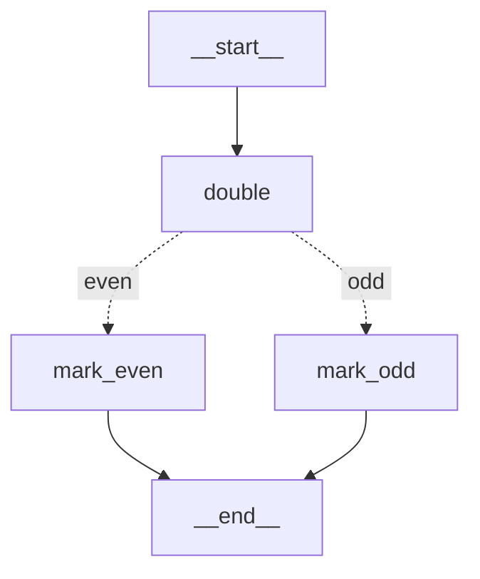
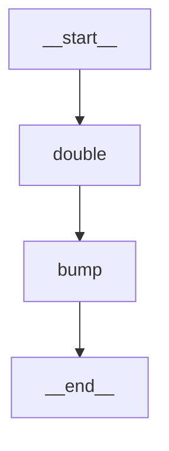
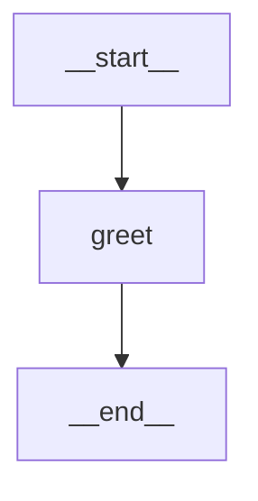
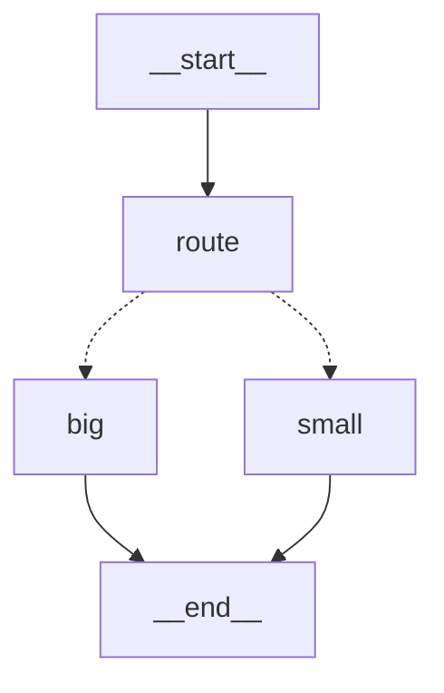
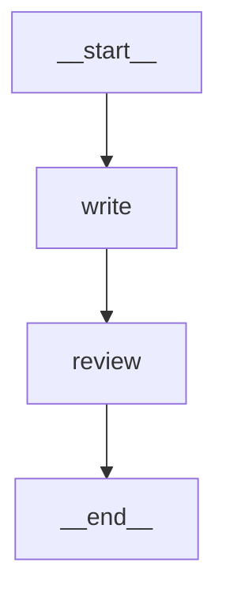
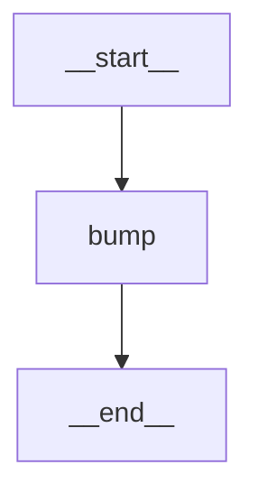
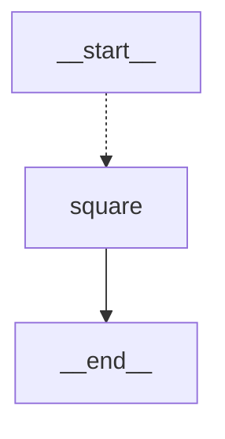

# `langgraph` Reference

> **Superseded.** A newer edition of this file, updated to langgraph 1.2.11 with re-verified examples,
> lives on yuval.guide: <a href="https://www.yuval.guide/ai/langgraph-reference/" target="_blank" rel="noopener">langgraph-reference</a>.
> The <a href="https://www.yuval.guide/ai/langchain-stack/" target="_blank" rel="noopener">stack overview</a> explains how the three packages relate.
> This copy is kept as it was for the course material that references these versions.

**Pinned version: `langgraph==1.2.10`** — everything below was derived by inspecting this exact
installed package, and every example was executed against it. Each heading links to
[reference.langchain.com](https://reference.langchain.com/python/langgraph), which is
unversioned and always serves the latest 1.x.

## What `langgraph` is

- **It is the graph runtime the rest of the ecosystem compiles down to.** You describe an
  application as nodes (plain Python functions) and edges (what runs next); the runtime handles
  execution order, parallelism, state merging, persistence and resumption.
- **"Low level" means the level at which agent architecture is expressed** — where you decide the
  loop, the branches and the pause points — not "hard mode".
- **It is model-agnostic.** The runtime does not care what a node does, which is why every example
  below is a plain Python function and imports nothing but `langgraph` and stdlib `typing`.
- **In LangChain 1.x, `langchain` depends on `langgraph` — not the other way around.**
  `langchain.agents.create_agent` returns a compiled graph, so `invoke`, `stream`, checkpointing
  and `interrupt` behave exactly as documented below.

### Layer order

```
langchain  ──depends on──▶  langgraph  ──depends on──▶  langchain-core
```

Nothing below depends on anything above it. Verified against the installed packages:

- **`langchain_core` does not import `langgraph`.** Zero import statements; after importing every
  module of `langchain-core` 1.5.3, `'langgraph' in sys.modules` is `False`. It stays deliberately
  compatible without depending — `runnables/config.py` even carries the comment
  `# This is imported and used in langgraph, so don't break.`
- **`langgraph` does not import `langchain`.** Never at import time, and `langchain` is absent from
  its `Requires-Dist`. Two optional code paths try lazily inside `try: / except ImportError:` —
  `init_chat_model` for `"provider:model"` strings in the deprecated `create_react_agent`, and
  `init_embeddings` in the store — and both fail soft when it is missing.
- **`langgraph` does depend on `langchain-core`** (`<2,>=1.4.7`), which is how a node can return
  message objects the rest of the ecosystem understands.

Every example in this file was executed in a venv where **`langchain` is not installed at all**.

> **Old tutorials warning:** anything using `langgraph.prebuilt` (`create_react_agent`, `ToolNode`)
> is deprecated since LangGraph v1.0 — `create_react_agent` now says "has been moved to
> `langchain.agents`. Please update your import to `from langchain.agents import create_agent`."

## Index

| Name | What it is | Most-used methods & fields |
| --- | --- | --- |
| [`StateGraph`](#stategraph) | The builder you describe your application with | `add_node`, `add_edge`, `add_conditional_edges`, `compile` |
| [`START` and `END`](#start-and-end) | The two virtual nodes marking entry and exit | used as edge endpoints |
| [`CompiledStateGraph`](#compiledstategraph) | What `.compile()` returns — the runnable graph | `invoke`, `stream`, `get_state`, `get_graph` |
| [`MessagesState`](#messagesstate) | Ready-made state schema holding a message list | `messages` |
| [`add_messages`](#add_messages) | The reducer that appends messages instead of replacing | called as `add_messages(left, right)` |
| [`Command`](#command) | A node return value that both updates state and routes | `goto`, `update`, `resume` |
| [`interrupt`](#interrupt) | Pauses the graph mid-node and waits for a human | called as `interrupt(value)` |
| [`InMemorySaver`](#inmemorysaver) | Checkpointer that makes a graph resumable | `get_tuple`, `put`, `list` |
| [`Send`](#send) | Fans one step out into N parallel node runs | `node`, `arg` |

---

### [`StateGraph`](https://reference.langchain.com/python/langgraph/graph/state/StateGraph)

The builder. You give it a state schema (a `TypedDict`), register functions with `add_node`, wire
them with `add_edge`, add branching with `add_conditional_edges`, then call `compile()` to get
something runnable. A node receives the current state and returns a dict of the keys it wants to
change — the runtime merges that into the state rather than replacing it.

```python
from typing import TypedDict

from langgraph.graph import END, START, StateGraph


class State(TypedDict):
    n: int
    label: str


def double(state: State) -> dict:
    return {"n": state["n"] * 2}


def classify(state: State) -> str:
    return "even" if state["n"] % 2 == 0 else "odd"


def mark_even(state: State) -> dict:
    return {"label": "even"}


def mark_odd(state: State) -> dict:
    return {"label": "odd"}


builder = StateGraph(State)
builder.add_node("double", double)
builder.add_node("mark_even", mark_even)
builder.add_node("mark_odd", mark_odd)
builder.add_edge(START, "double")
builder.add_conditional_edges("double", classify, {"even": "mark_even", "odd": "mark_odd"})
builder.add_edge("mark_even", END)
builder.add_edge("mark_odd", END)

graph = builder.compile()
print(graph.invoke({"n": 5, "label": ""}))   # {'n': 10, 'label': 'even'}
print(graph.get_graph().draw_mermaid(with_styles=False))
```

Diagram — generated by the code above:



[↩ back to index](#index)

---

### [`START`](https://reference.langchain.com/python/langgraph/constants/START) and [`END`](https://reference.langchain.com/python/langgraph/constants/END)

Two virtual nodes that mark where execution enters and leaves the graph. They are not classes —
they are interned strings, `'__start__'` and `'__end__'`, which is exactly why they can be passed
anywhere a node name is expected. An edge from `START` declares the entry point; an edge to `END`
declares a terminal node.

```python
from langgraph.graph import END, START

print(repr(START), repr(END))   # '__start__' '__end__'
print(isinstance(START, str))   # True
```

[↩ back to index](#index)

---

### [`CompiledStateGraph`](https://reference.langchain.com/python/langgraph/graph/state/CompiledStateGraph)

What `.compile()` hands back, and the only thing you actually run. It is a Runnable, so it has
`invoke`, `stream`, `batch` and their async twins; on top of that it adds the state API
(`get_state`, `get_state_history`, `update_state`) and `get_graph()`, whose `draw_mermaid()`
produces the diagrams in this file. Streaming yields one chunk per node as it finishes.

```python
from typing import TypedDict

from langgraph.graph import END, START, StateGraph


class State(TypedDict):
    n: int


def double(state: State) -> dict:
    return {"n": state["n"] * 2}


def bump(state: State) -> dict:
    return {"n": state["n"] + 1}


builder = StateGraph(State)
builder.add_node("double", double)
builder.add_node("bump", bump)
builder.add_edge(START, "double")
builder.add_edge("double", "bump")
builder.add_edge("bump", END)
graph = builder.compile()

print(type(graph).__name__)           # CompiledStateGraph
print(graph.invoke({"n": 3}))         # {'n': 7}
for chunk in graph.stream({"n": 3}):
    print(chunk)                      # {'double': {'n': 6}} then {'bump': {'n': 7}}
print(graph.get_graph().draw_mermaid(with_styles=False))
```

Diagram — generated by the code above:



[↩ back to index](#index)

---

### [`MessagesState`](https://reference.langchain.com/python/langgraph/graph/message/MessagesState)

A ready-made state schema for the common case of "the state is a conversation". It is a `TypedDict`
with a single key, `messages`, already annotated with the [`add_messages`](#add_messages) reducer,
so nodes return new messages and the runtime appends them. Message-like dicts are converted to
proper message objects on the way in — no model or langchain import needed.

```python
from langgraph.graph import END, MessagesState, START, StateGraph


def greet(state: MessagesState) -> dict:
    return {"messages": [{"role": "assistant", "content": "Hello!"}]}


builder = StateGraph(MessagesState)
builder.add_node("greet", greet)
builder.add_edge(START, "greet")
builder.add_edge("greet", END)
graph = builder.compile()

result = graph.invoke({"messages": [{"role": "user", "content": "Hi"}]})
for m in result["messages"]:
    print(type(m).__name__, "|", m.content)
# HumanMessage | Hi
# AIMessage | Hello!
print(graph.get_graph().draw_mermaid(with_styles=False))
```

Diagram — generated by the code above:



[↩ back to index](#index)

---

### [`add_messages`](https://reference.langchain.com/python/langgraph/graph/message/add_messages)

The reducer behind `MessagesState`. A reducer is a function `(old, new) -> merged` attached to a
state key via `Annotated`; without one, a node's return value overwrites the key. `add_messages`
appends instead — except when an incoming message carries an existing `id`, in which case it
replaces that message in place. That is how you edit history rather than duplicate it.

```python
from langgraph.graph import add_messages

history = add_messages(
    [{"role": "user", "content": "Hi", "id": "1"}],
    [{"role": "assistant", "content": "Hello!", "id": "2"}],
)
print([(type(m).__name__, m.content) for m in history])
# [('HumanMessage', 'Hi'), ('AIMessage', 'Hello!')]

edited = add_messages(history, [{"role": "user", "content": "Hey", "id": "1"}])
print([(type(m).__name__, m.content) for m in edited])
# [('HumanMessage', 'Hey'), ('AIMessage', 'Hello!')]
```

[↩ back to index](#index)

---

### [`Command`](https://reference.langchain.com/python/langgraph/types/Command)

A node can return a `Command` instead of a plain dict to do two things at once: update state
(`update=`) and choose the next node (`goto=`). This replaces a separate routing function when the
node already knows where to go. Annotating the return type as `Command[Literal[...]]` is what lets
the runtime draw those dynamic edges — without it the diagram shows none.

```python
from typing import Literal, TypedDict

from langgraph.graph import END, START, StateGraph
from langgraph.types import Command


class State(TypedDict):
    n: int
    path: str


def route(state: State) -> Command[Literal["big", "small"]]:
    if state["n"] > 10:
        return Command(goto="big", update={"path": "big"})
    return Command(goto="small", update={"path": "small"})


def big(state: State) -> dict:
    return {"n": state["n"] + 100}


def small(state: State) -> dict:
    return {"n": state["n"] + 1}


builder = StateGraph(State)
builder.add_node("route", route)
builder.add_node("big", big)
builder.add_node("small", small)
builder.add_edge(START, "route")
builder.add_edge("big", END)
builder.add_edge("small", END)
graph = builder.compile()

print(graph.invoke({"n": 42, "path": ""}))   # {'n': 142, 'path': 'big'}
print(graph.get_graph().draw_mermaid(with_styles=False))
```

Diagram — generated by the code above:



[↩ back to index](#index)

---

### [`interrupt`](https://reference.langchain.com/python/langgraph/types/interrupt)

Pauses the graph in the middle of a node and surfaces a value to the caller — the human-in-the-loop
primitive. It requires a checkpointer, because pausing means persisting the run and picking it up
later. `invoke` returns with an `__interrupt__` key instead of a final answer; you resume by
invoking the same thread with `Command(resume=...)`, and the node re-runs with `interrupt()`
returning that value.

```python
from typing import TypedDict

from langgraph.checkpoint.memory import InMemorySaver
from langgraph.graph import END, START, StateGraph
from langgraph.types import Command, interrupt


class State(TypedDict):
    draft: str
    approved: str


def write(state: State) -> dict:
    return {"draft": "ship it"}


def review(state: State) -> dict:
    decision = interrupt({"question": "Approve this draft?", "draft": state["draft"]})
    return {"approved": decision}


builder = StateGraph(State)
builder.add_node("write", write)
builder.add_node("review", review)
builder.add_edge(START, "write")
builder.add_edge("write", "review")
builder.add_edge("review", END)
graph = builder.compile(checkpointer=InMemorySaver())

config = {"configurable": {"thread_id": "1"}}
paused = graph.invoke({"draft": "", "approved": ""}, config)
print(paused["__interrupt__"][0].value)
# {'question': 'Approve this draft?', 'draft': 'ship it'}

resumed = graph.invoke(Command(resume="yes"), config)
print(resumed)   # {'draft': 'ship it', 'approved': 'yes'}
print(graph.get_graph().draw_mermaid(with_styles=False))
```

Diagram — generated by the code above:



[↩ back to index](#index)

---

### [`InMemorySaver`](https://reference.langchain.com/python/langgraph.checkpoint/memory/InMemorySaver)

A checkpointer: pass one to `compile()` and the graph saves a snapshot after every step, keyed by
the `thread_id` in the config. That single change is what turns a one-shot graph into a resumable,
inspectable conversation — it is the prerequisite for `interrupt`, for `get_state`, and for picking
a run back up tomorrow. It implements
[`BaseCheckpointSaver`](https://reference.langchain.com/python/langgraph.checkpoint/base/BaseCheckpointSaver),
the interface every backend satisfies; `InMemorySaver` keeps everything in a dict, so it is for
development and tests, and a database-backed saver is the production swap.

```python
from typing import TypedDict

from langgraph.checkpoint.base import BaseCheckpointSaver
from langgraph.checkpoint.memory import InMemorySaver
from langgraph.graph import END, START, StateGraph


class State(TypedDict):
    count: int


def bump(state: State) -> dict:
    return {"count": state["count"] + 1}


builder = StateGraph(State)
builder.add_node("bump", bump)
builder.add_edge(START, "bump")
builder.add_edge("bump", END)

checkpointer = InMemorySaver()
print(isinstance(checkpointer, BaseCheckpointSaver))   # True
graph = builder.compile(checkpointer=checkpointer)

config = {"configurable": {"thread_id": "session-1"}}
print(graph.invoke({"count": 0}, config))     # {'count': 1}
print(graph.get_state(config).values)         # {'count': 1}
print(graph.get_state(config).next)           # () — the run finished
print(graph.get_graph().draw_mermaid(with_styles=False))
```

Diagram — generated by the code above:



[↩ back to index](#index)

---

### [`Send`](https://reference.langchain.com/python/langgraph/types/Send)

Fans one step out into N parallel runs of the same node, each with its own private input. Returned
as a list from a conditional edge, it is the map half of map-reduce: the target node runs once per
`Send`, concurrently, and their outputs are merged back by the state key's reducer. Use it when the
number of branches is only known at runtime.

```python
from typing import Annotated, TypedDict

from langgraph.graph import END, START, StateGraph
from langgraph.types import Send


class State(TypedDict):
    items: list
    results: Annotated[list, lambda a, b: a + b]


def fan_out(state: State):
    return [Send("square", {"value": i}) for i in state["items"]]


def square(state: dict) -> dict:
    return {"results": [state["value"] ** 2]}


builder = StateGraph(State)
builder.add_node("square", square)
builder.add_conditional_edges(START, fan_out, ["square"])
builder.add_edge("square", END)
graph = builder.compile()

print(graph.invoke({"items": [1, 2, 3], "results": []}))
# {'items': [1, 2, 3], 'results': [1, 4, 9]}
print(graph.get_graph().draw_mermaid(with_styles=False))
```

Diagram — generated by the code above:



[↩ back to index](#index)
