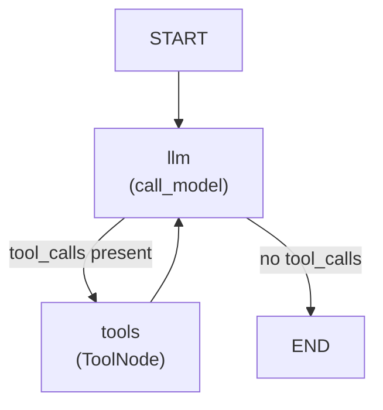

# Criminal Search Agent — Description

## What is a ReAct Agent?

A ReAct agent interleaves **reasoning** and **acting**: the LLM thinks about what to do, calls a tool to get new information, then reasons again over the result — repeating until it has enough to answer. This _think → act → observe_ loop is what the `llm → tools → llm` cycle in the graph implements.

## Agent Graph Structure



| Node | Role |
|---|---|
| `llm` | Calls GPT-4o with the full message history; decides whether to invoke a tool or return a final answer |
| `tools` | Executes whichever tool the LLM requested and appends the result to the message history |

The loop `llm → tools → llm` repeats until the LLM produces a plain text reply (no tool call), at which point the graph exits.

---

## LLM and Tool Binding

**Model:** `gpt-4o` via `ChatOpenAI` from `langchain_openai` — used here purely as a thin wrapper around the OpenAI API. The higher-level LangChain framework (chains, LangChain agents, memory) is **not** used; all agent logic lives in LangGraph.

Tool binding is done with:

```python
model = ChatOpenAI(model="gpt-4o").bind_tools(tools)
```

`.bind_tools()` converts each `@tool` function into a JSON schema and attaches it to every request sent to the model. GPT-4o can then signal that it wants to call a tool by returning a message with a `tool_calls` field instead of plain text. The `should_continue` routing function inspects that field to decide the next graph node.

A **system prompt** is prepended to every LLM call explaining the two available tools and when to use each one.

---

## Tools

| Tool | Description |
|---|---|
| `search_by_face(image_path)` | Extracts the most prominent face from an image file using the ArcFace model and searches ChromaDB (`suspect_face_vectors`) for the top-5 most similar faces |
| `search_by_case_description(description)` | Embeds a free-text case description with OpenAI `text-embedding-3-large` and searches ChromaDB (`case_report_vectors`) for the top-5 most similar case reports |

---

## Supporting Functions (not tools)

Each tool is backed by three single-responsibility helpers that keep the tool function itself short:

```
search_by_face
  ├── resolve_image_path        — converts a bare filename to an absolute path
  ├── extract_best_face_embedding — reads the image and returns the ArcFace vector
  ├── query_face_collection     — runs the ChromaDB cosine similarity query
  └── format_face_results       — formats the raw matches into readable text

search_by_case_description
  ├── embed_text_with_openai    — calls the OpenAI embeddings API
  ├── query_case_collection     — runs the ChromaDB cosine similarity query
  └── format_case_results       — formats the raw matches into readable text
```
